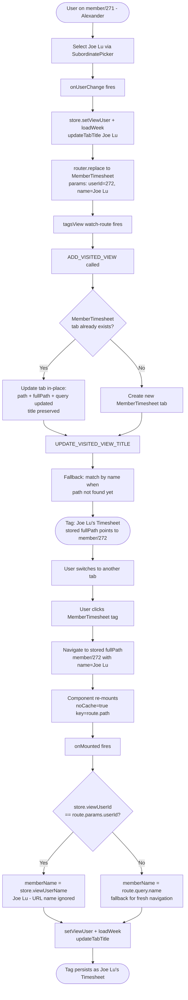

# Member Timesheet Tag State Fix

Paste the code block below into https://mermaid.live to render.

## Key steps

| Step | Description |
|---|---|
| 1 | User picks Joe Lu via SubordinatePicker on Alexander's member page |
| 2 | `onUserChange` updates store + data + title, then calls `router.replace` to Joe Lu's URL |
| 3 | `ADD_VISITED_VIEW` detects existing MemberTimesheet tab and updates it in-place instead of creating a duplicate |
| 4 | `UPDATE_VISITED_VIEW_TITLE` falls back to name-based lookup so the title update lands even before the path is stable |
| 5 | When the user returns to the tab, it navigates to Joe Lu's URL — `onMounted` reads `store.viewUserName` (Joe Lu) instead of `route.query.name` (which would be Alexander) |

## Notes

- `MemberTimesheet` route has `noCache: true` — the component always re-mounts on tab click, which is why `onMounted` was re-reading the URL and reverting the title
- The single-tab behavior mirrors the Production tab pattern already in the tagsView store
- `store.viewUserId === memberUserId` guard in `onMounted` is what prevents the URL name from overwriting the stored name after a `router.replace`
- If the user opens Alexander's tab from scratch (no prior `onUserChange`), the fallback path still reads from `route.query.name` correctly
