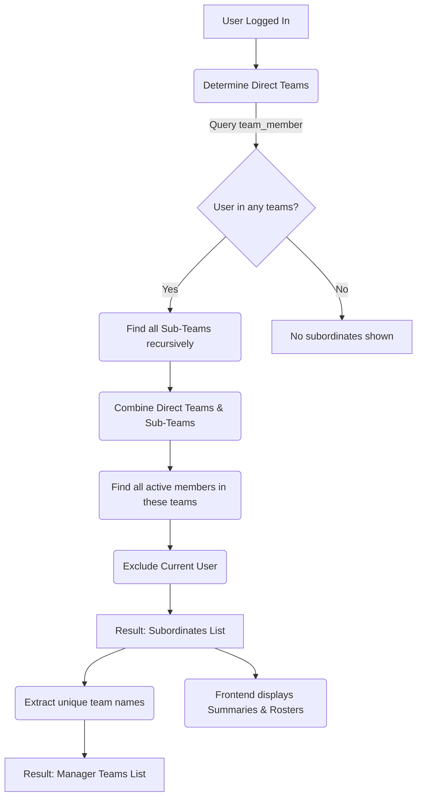

# Timesheet Report 第一版功能说明

## 功能目的

管理员可以选择一个时间段，将 Timesheet 报告发送给指定收件人。

第一版只用于手动发送和测试，不与 Auto-submit 联动。

## 权限

只有拥有 `timesheet:viewall` 权限的管理员可以看到和使用此功能。

## 页面入口

在 Team Timesheets 页面顶部工具栏增加：

`Send Timesheet Report`

点击后打开一个简单的发送窗口。

## 发送窗口

管理员只需要填写：

- `Date Range`：报告的开始日期和结束日期
- `Recipients`：一个或多个收件人邮箱

窗口包含两个按钮：

- `Send`
- `Cancel`

## 报告内容

报告包含所选时间段内所有员工的：

- 员工姓名
- 每日工时
- 总工时

## 发送规则

1. 管理员选择时间段并填写收件人。
2. 管理员点击 `Send`。
3. 系统生成报告并立即发送。
4. 页面提示发送成功或失败。

## 第一版不包含

- Auto-submit 联动
- 自动或定时发送
- 选择指定员工
- 普通员工发送自己的报告
- 报告预览
- 自定义邮件内容
- 发送历史页面
- 失败自动重试

完成手动发送测试并确认报告内容正确后，再讨论后续功能。

*最后更新：2026-06-09*

---

## Timesheet Subordinates Logic
The timesheet system determines which teams and personnel (subordinates) are shown for a logged-in user based on the following logic:

1. **Direct Memberships**: The system first finds all teams the current user is directly a member of (via `user_management.team_member`). There is no check for team leader status (`is_leader`); any member of a team is granted visibility to other members of that team and all its child teams.
2. **Recursive Sub-Teams**: It recursively finds all child teams of those direct teams using the parent-child relationship (`pid`) in `user_management.team`.
3. **Personnel Aggregation**: It collects all active users who are members of this entire tree of teams (parent and child teams).
4. **Self-Exclusion**: The current user (caller) is excluded from this list.
5. **Team Extraction**: The available teams in the UI (e.g., in the dropdowns) are derived by extracting the distinct team names from this aggregated list of subordinates.

### Logic Diagram

